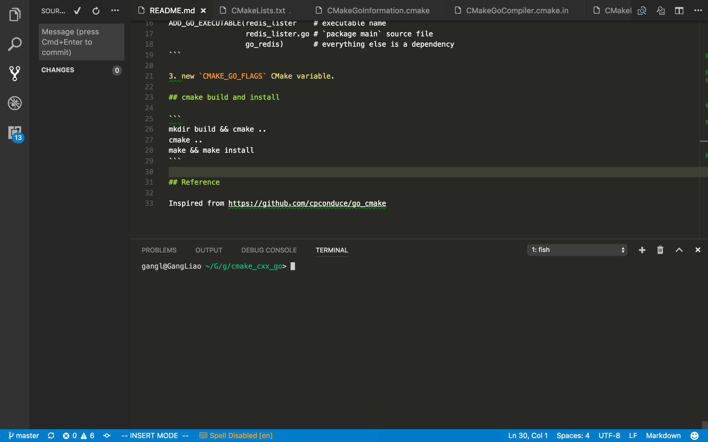

# cmake_cxx_go

We add some custom CMake functions to support golang including `go get`, `go build`, `go install`.

## custom functions

1. `ExternalGoProject_Add`

```
ExternalGoProject_Add(go_redis github.com/hoisie/redis)
```

2. `ADD_GO_EXECUTABLE`

```
ADD_GO_EXECUTABLE(redis_lister    # executable name
                  redis_lister.go # `package main` source file
                  go_redis)       # everything else is a dependency
```

3. `ADD_GO_LIBRARY`

```
add_go_library(adder STATIC)  # build library libaddr.a
add_executable(main main.cxx) # build binary main
add_dependencies(main adder)  # adder is a dependency of main
target_link_libraries(main ${CMAKE_CURRENT_BINARY_DIR}/libadder.a) # link libaddr.a into main
```

## cmake build and install

```
mkdir build && cmake ..
make && make install
```

## Test cases

- [x] redis: redis lister
- [x] recordio: `go get` external projects and build a library
- [x] **static_and_shared: C++ calling from go static/dynamic library**
- [ ] **cuda: go calling from CUDA kernel**

## Demo

<a href="img/demo.gif" target="_blank"></a>


## Reference

Inspired from https://github.com/cpconduce/go_cmake